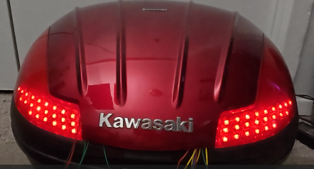
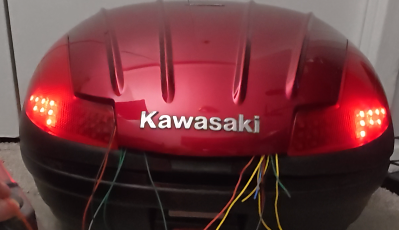

# topcase\_E470\_leds

Motorcycle Top Box Brake And Turn Signal Lights
V1.0  2025 Author: John Zonneveld

This sketch will run LED sequences that will add both brake lights and turn signals to my Kawasaki branded Givi
E470 Monolock top box. The only difference between the Kawa box and the Givi box is the lid panel. The Givi lid
panel already includes a lens for a center mounted light assembly. Because of this there is some spare space under
the panel lid in the Kawa box. in that spare space I will mount my arduino contraption which includes a buck converter
and an Arduino Nano.
In total I will mount 6 LED strips of various lengths of WS2812B with 60 LEDs/m, three on each side with 9, 8 and 6 LEDs.
The total mounted LEDs equals 2x9 + 2x8 + 2x6 = 46 LEDs. On white, with full brightness this would total to about 46 x
60mA = 2.76A. There is an accessoiry lead in the tail of the bike which is fused 5A, only problem is that it shares the
fuse with the accesoiry lead in the fairing that is in use for my Garmin. (will have to check about the cig lighter on
the right, if that is using the same fuse)
Also it doesn't really make sense to create white light when the additional colors are being filtered away by the lens,
because of this I will only use the Red section of the Neopixels. This would also reduce the power draw to about 46 x
20mA = 0.92A for the LEDs. The Arduino Nano takes about 40mA in worst case, but total current
draw would be at most 1.25A continous while braking.

The connection to the strips will be on the outside left of the strips on the left and outside right for the strips on
the right.
The factory kit will only do brake lights, Admore is selling a kit that would do running/brake lights and turning signals
with a strip of 9 and 6 LEDs on each side.
This setup will provide:

* Running lights (dimmed, only outside LEDs)
* Brake light (both sides on, warning flash at start. All LEDs)
* Turn signal (one side all LEDs sequential flashing, other side running lights unless braking then other side is solid on
  )
* Hazard light (both sides sequential flashing from inside to outside)

This can obviously be customized as needed.  To convert the 12V signals to the Arduino Inputs 5V signal I used optocouplers.
This setup uses an Arduino Nano and a 12VDC buck converter to obtain a 5V power source to pwer the Arduino and the LED strips.
Because of this setup I can not use the 2 wire kit that Givi sells and uses contacts for easy removal of the box.
For this setup we need to bring 5 wires to the box:

* 12V
* Ground
* Left turn signal
* Right turnsignal
* Brake light

  I bought some water proof connecters but also a 5 pin trailer wiring harness. which I probably hide somewhere under the seat.
  I did buy a Plug&Play wiring harness from Admore Lighting, installation on my 2014 C14 was done within 30 minutes.
  For this I needed to remove the toolbox, 4x 4mm allen bolts. Remove a clipped on fusebox from the toolbox. Behind the toolbox is the ECU that is just resting on some rubbers. To remove the ECU there is no need to disconnect the cables, just lift it and pull forward.
  There is also a plastic cover around this section, not sure what the function is but it is only mounted with 2 5mm allen bolt on the front and slid into the tail section. Remove the bolts and pull it forward to remove.
  Now you will gain access to the tail where a rubber boot is with all the connections for the turn signals and tail/brake light. The admore kit just plugs in between the existing plugs. According to Admore this should be able to provide 2A for additional lighting.

Timings used in this sketch still have to be adapted to the bike escpecially the times used in the turn signals to fill the
strip up and the pulse monitoring before dropping the turn signal

This will be the view when system is in rest (no inputs from signals or brake)

Update November 9th 2025

Times have been adapted to my bike, relays might differ so changes might be needed. This will work but not 100% content with it.
What I noticed but can't do much about is that the installed brake light modulator (GS-100A). It's behavior is not consistent, sometimes the original brake light starts immediately sometimes it is a bit delayed. Timing and number of flashes is the same but there could be a small difference between the LEDs and the original brake light.
I changed the turn signal subroutines and added an extra blinkRelay() subroutine, actualy it is not really needed and could be replaced by a digitalRead for either rightPin or leftPin. I added it so I could use a timed version in an online simulator.
Now when the original turnsignal is off the LED turnsignal is off as well and the turnsignal starts again the moment the original turn signal comes on again.
Only the initial switch on might not be to appealing. Will continue to work on that to improve that part, but I think it will need some overthinking of the complete turnSignal subroutine.

For the turnsignals routine we want to turn the running lights for that direction off but don't want them to turn back on when the signal goes low and the input is pulsed. For that we built in a timer. I measured the turnsignal on a 30fps video that I took, maybe for accuracy I should have used 60fps.
Once the turnsignal is stabilized it runs about 65-66 frames between on cycles. This equals to about 2.17 and 2.2 seconds. The first signal only lasts about 35 frames which is about 1.17 seconds. 
What I measured was 35 frames-66 frames - 65 frames. Because of that the first signal on the LEDs is a bit messed up.
I am thinking of measuring the exact times between the rise of the turnsignal input signal but am not 100% sure if the on time is exactly the same as the offtime.
I have noticed now that sometimes before the LEDs turn off before the next cycle the previous cycle already started with a new sequential pattern but that should be an easy fix not to start a new sequential pattern after the LEDs have been filled and have been turned off.

Work in progress...